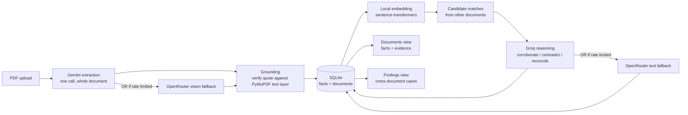
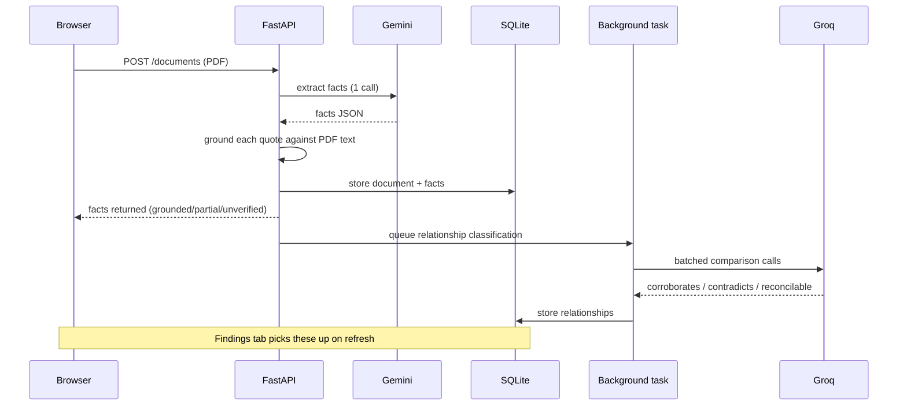

# TruthLoom

Extracts facts from PDFs and checks where they corroborate, contradict, or reconcile across documents, with every fact grounded to the exact sentence or figure in its source.

## Setup and Run Instructions

Requirements: Python 3.12+, Node 18+, and free API keys for Gemini, Groq, and OpenRouter.

- Gemini: https://aistudio.google.com/apikey (Google AI Studio, free tier)
- Groq: https://console.groq.com/keys
- OpenRouter: https://openrouter.ai/keys

**Backend**

```
cd backend
python -m venv .venv
.venv\Scripts\activate        (Windows; use `source .venv/bin/activate` on macOS/Linux)
pip install -r requirements.txt
copy .env.example .env        (or `cp .env.example .env`)
```

Fill in the three keys in `.env`, then:

```
uvicorn app.main:app --port 8000
```

**Frontend** (separate terminal)

```
cd frontend
npm install
npm run dev
```

Open http://localhost:5173, upload a PDF from `Input_Data/starter-datasets/`, and wait roughly 30 to 90 seconds depending on page count. Facts appear as soon as extraction finishes; cross-document comparisons populate a little after that in the background, refresh the Findings tab if you just uploaded something.

A note on free tier limits: Gemini's free tier caps at around 20 requests per day per model, and Groq caps at 8000 tokens per minute. Each document upload is one Gemini request regardless of page count, and the comparison step batches its Groq calls, but heavy back to back testing can still exhaust a day's quota. If that happens the app returns a clear error instead of crashing, see Limitations below.

## Video Demo

[link to be added]

## The Four Required Cases

Quick reference for where each one lives in the running app (Findings tab, filtered).

| # | Case | Example | Where to look |
|---|------|---------|----------------|
| 1 | Corroborated across documents | IMF and RBI independently report the same 6.5% real GDP growth for FY2024-25, worded completely differently | Findings → Corroborated |
| 2 | Genuine or likely contradiction | RBI's own Monetary Policy Committee projection (4.8%) vs. a separate RBI Annual Report projection (4.0%), shown as *likely* rather than certain since the fiscal year labels ("FY25" vs "2025-26") are genuinely ambiguous across institutional convention | Findings → Contradictions |
| 3 | Apparent contradiction explained by context | 6.4% vs. 6.5% real GDP growth for the same period, explained as a provisional first estimate vs. a later revised figure | Findings → Reconciled |
| 4 | Extraction or reasoning failure, found and handled | ~40% of one document's facts came back unverifiable; root cause was that curated excerpts splice non-contiguous page ranges from a longer original report, so a page printed "44" can sit anywhere in the file. Fixed by resolving the model's printed page number against each page's own header/footer, recovering the grounded rate from 57% to 97% | Findings → Needs review (residual cases), full story in Additional Notes and the git history |

## Approach

### Tech stack

| Layer | Technology | Why |
|---|---|---|
| Backend | FastAPI (Python) | Async-friendly, minimal boilerplate, good fit for a PDF/LLM pipeline |
| PDF text & geometry | PyMuPDF (fitz) | Reads the embedded text layer and exact coordinates for grounding, renders pages to images for display |
| Fact extraction | Gemini (`gemini-3.6-flash`) | Native multimodal PDF understanding in one call, no manual OCR or per-page requests |
| Extraction fallback | OpenRouter (vision model) | Second free-tier pool for when Gemini is rate limited or over quota |
| Cross-document reasoning | Groq (`openai/gpt-oss-20b`) | Fast, free-tier inference for the corroborate/contradict/reconcile classification |
| Reasoning fallback | OpenRouter (text model) | Second free-tier pool for the reasoning step |
| Embeddings | sentence-transformers (local) | Candidate matching without a third API or rate limit |
| Storage | SQLite | Zero-setup, flexible JSON-friendly fact records, fine for a local prototype |
| Frontend | React + Vite | Small, fast dev loop for an evidence browser and findings list |

No graph database, per the assignment's own note that one isn't the solution by itself.

### Architecture



### Request lifecycle

The upload response doesn't wait on cross-document reasoning, it's the slower, more rate-limit-sensitive step, so it runs after the response is already sent.



### Decisions and trade-offs

**Extraction.** Gemini reads the whole PDF in a single API call using its native multimodal document understanding, no OCR and no per-page calls. It returns a JSON list of facts as `{subject, predicate, value, unit, time_period, scope, quote, page}`, where `quote` is meant to be a verbatim phrase from the source and `page` is whatever page number the model read off the document. If Gemini is unavailable, a vision fallback (OpenRouter) renders pages to images and does the same job.

**Grounding.** The `quote` and `page` are not trusted on their own. PyMuPDF searches the PDF's actual text layer for that quote on that page; if it's not found exactly, the code falls back to a normalized-whitespace match, then the longest distinctive phrase in the quote, then the bare value as a last resort, each tier marked with a confidence flag. Facts that pass are marked grounded, partial matches are flagged, and facts that can't be located at all are shown as unverified rather than silently trusted. Curated excerpts also needed a separate fix: they splice non-contiguous page ranges from a much longer original report, so a page printed "44" can sit anywhere in the file, handled by resolving the model's printed page number against each page's own header/footer.

**Cross-document reasoning.** Each new fact is embedded locally (sentence-transformers, no API call) and compared against every fact already stored from other documents. Candidates above a similarity threshold are sent to an LLM (Groq, with an OpenRouter fallback) which classifies the pair as corroborating, contradicting, reconcilable, or unrelated, with a short explanation citing the actual values. Candidates for one fact are batched into a single call rather than one call per pair, which matters a lot against a free tier's token budget.

**Storage.** SQLite, with facts stored as flexible records rather than a fixed domain schema (no `revenue_amount` or `director_name` columns), so a new kind of fact just appears as a new predicate value, no migration needed.

**Frontend.** Two views: Documents, for browsing a document's facts with evidence and related facts, and Findings, a single cross-document list of every corroboration, contradiction, and reconciled difference, filterable by type, plus any fact that failed to fully ground. Facts return immediately on upload; relationship classification runs as a background task afterward so a slow comparison step doesn't hold up the response.

**Brownie points touched.** Multiple documents in one knowledge layer (tested with up to 6 at once). Incremental ingestion by construction, a new document's facts are only compared against what's already stored, never reprocessed. Large PDFs handled as a single call regardless of page count, though the free tier's comparison rate limit is the real bottleneck at scale, not extraction. Dynamic schema, since facts have no fixed columns per domain.

**AI tools used.** Claude Code, throughout, in a pair-programming style. Every extraction and grounding claim in this README was verified against real API calls and real output during development, not mocked.

## Limitations and Next Steps

- **Free tier rate limits are the main operational constraint.** Comparing a large multi-document corpus can take several minutes to fully populate because of Gemini's daily cap and Groq's per-minute token limit, not because of inefficient code.
- **Grounding is text-layer only.** A fact extracted purely from a chart or image with no accompanying printed number can't be verified this way and shows as not grounded. That's intentional honesty rather than a false positive, but it means chart-heavy documents will show more unverified facts.
- **Genuine contradictions are rare in careful, audited documents.** Most apparent mismatches found across the starter datasets were legitimately explainable by time, scope, or units. The one relationship the system labeled a contradiction is presented with an honest caveat, the two documents use "FY25" and "2025-26" which may or may not refer to the same fiscal year depending on institutional convention, so it's shown as a likely rather than certain contradiction.
- **Page-number resolution can still fail.** It depends on finding one unambiguous number near a page's top or bottom edge; an unusually formatted header leaves a handful of facts genuinely unverifiable.
- **No document management in the UI yet.** Removing a bad upload currently means editing the database directly.
- **Not deployed, runs locally only,** by design for this submission. A real deployment would swap SQLite for Postgres, local disk for object storage, and the in-process background task for a proper job queue, none of which change the core approach.

Next steps with more time: a rate-limit-aware backoff that reads the provider's own retry hint instead of a fixed delay; an OCR fallback (e.g. Tesseract) specifically for pages with no embedded text layer at all, which none of the current documents need but a scanned upload would; a delete/manage-document feature; and chunked parallel extraction for very large PDFs.

## Additional Notes

Two real bugs were found and fixed through actually running the pipeline against the starter documents rather than reasoning about the code in the abstract: the page-numbering mismatch above, and a bounding-box bug where a search match that wrapped across a line break was only keeping its first word fragment instead of the full phrase. Both are documented in the git history with before/after numbers. A third apparent bug (a highlight that looked like it was in the wrong place) turned out to be a correct result read incorrectly from a downscaled screenshot, worth mentioning since verifying against the real DOM rather than trusting a screenshot is what caught the difference.
